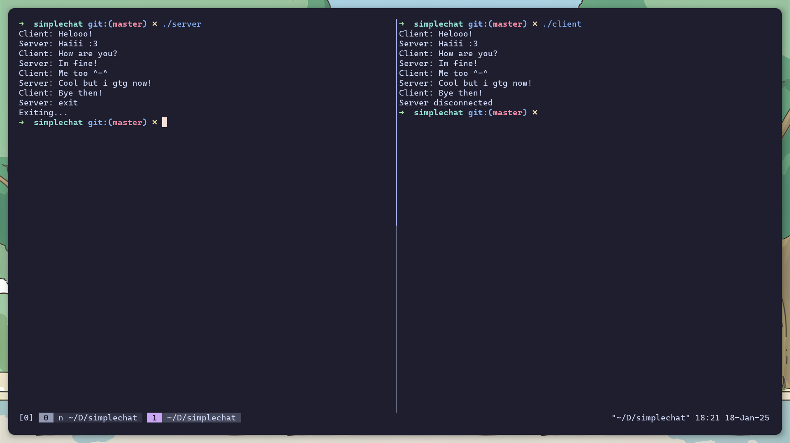

# TCP Chat App

This is a **very** simple chat app built with tcp sockets in C. You can use this as a learning resource or as a reference!

(132 lines of code in total)



## How to compile

```sh
# Compile the server
gcc -o server server.c

# Compile the client
gcc -o client client.c
```

## How to run

Make sure to run the client and server in **seperate** terminals.

```sh
# Run the server
./server

# Run the client
./client
```

You can type exit to close the connection!
